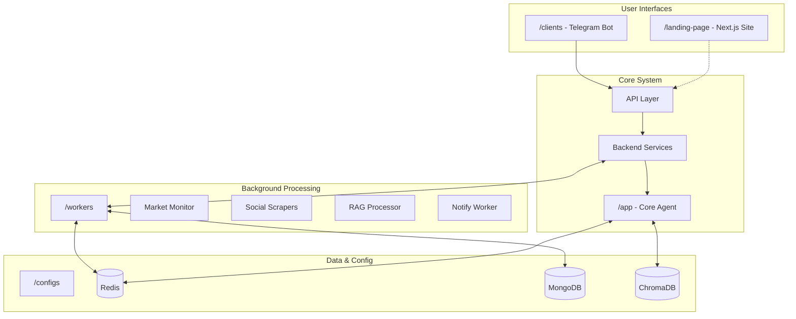

# ImpressoX Project Documentation

## Overview

ImpressoX is an AI agent for DeFi wallet management, built to automate and simplify cross-chain operations using the Espresso Network. This documentation covers the project's architecture, components, and development guidelines.

## Project Status (May 2025)

### Implemented Components
- ✅ **Core Architecture**
  - Agent orchestrator and node system
  - Tool registry and prompt management
  - Backend service layer concept
  - Redis-based caching and state management

- ✅ **Market Monitoring**
  - Rule-based price tracking system
  - Redis rules storage
  - Price monitoring tools
  - Basic notification dispatch

- ✅ **Social Data Collection**
  - X-Scraper worker (Node.js/Puppeteer)
  - Twitter Scraper (Python alternative)
  - Airdrop-specific Twitter scraper
  - MongoDB data storage

- ✅ **Client Interface**
  - Telegram bot with session management
  - Landing page (Next.js)

### Under Development
- 🔄 **Backend Service Layer**
  - Formalizing the service architecture
  - Standardizing API-backend communication
  - Implementing service interfaces

### Planned Features
- 📋 **Blockchain Integration**
  - Smart contract development
  - Espresso Network integration
  - Cross-chain transaction handling

- 📋 **Client Expansion**
  - Web interface
  - Discord bot

## Project Structure



## Directory Structure

```
impressox-agent/
├── app/                    # Core AI agent
│   ├── agents/            # Agent system
│   ├── nodes/             # Processing nodes
│   ├── tools/             # Tool implementations
│   ├── core/              # Core services
│   ├── cache/             # Caching system
│   └── prompts/           # LLM prompts
│
├── clients/               # Client applications
│   ├── telegram/          # Telegram bot (active)
│   └── config.py         # Shared client config
│
├── workers/              # Background workers
│   ├── market_monitor/   # Price monitoring
│   ├── x-scraper/       # X/Twitter scraping (Node.js)
│   ├── twitter_scraper/ # Alternative scraper (Python)
│   ├── airdrop_twitter_scraper/ # Airdrop monitoring
│   ├── notify_worker/   # Notification handling
│   └── rag_processor/   # RAG implementation
│
├── landing-page/        # Project website (Next.js)
├── configs/             # Configuration files
├── docs/               # Documentation
└── memory-bank/        # AI development context
```

## Core Components Documentation

Each major component has its own detailed documentation:

- [Core Application Guide](app/README.md): Details on the AI agent implementation, including the agent system, nodes, tools, and backend services.
  
- [Client Applications Guide](clients/README.md): Documentation for client interfaces, focusing on the current Telegram bot implementation and planned web/Discord clients.
  
- [Workers Guide](workers/README.md): Information about background workers for market monitoring, social data collection, and notifications.
  
- [Smart Contracts Guide](contracts/README.md): Planned smart contract architecture and Espresso Network integration (future development).

## Development Setup

### Prerequisites
- Python 3.9+
- Node.js 16+ (for x-scraper and landing page)
- Redis
- MongoDB
- ChromaDB (for RAG processor)

### Quick Start
1. Clone the repository
2. Set up environment variables:
   ```bash
   cp .env.example .env
   # Edit .env with your configurations
   ```
3. Install Python dependencies:
   ```bash
   pip install -r requirements.txt
   ```
4. Start core services:
   ```bash
   # API Server
   bash run_api.sh

   # Telegram Bot
   bash run_tele.sh

   # Market Monitor
   bash run_monitor.sh

   # Notify Worker
   bash run_notify_worker.sh
   ```

For detailed setup instructions for each component, refer to their respective documentation sections.

## Contribution Guidelines

See [CONTRIBUTING.md](../CONTRIBUTING.md) for:
- Development workflow
- Code style guides
- Testing requirements
- Pull request process

## Contact & Support

- Website: [impressox.ai](https://impressox.ai) (Coming soon)
- Email: [contact@impressox.ai](mailto:contact@impressox.ai)
- Twitter/X: [@impressox](https://twitter.com/impressox)
