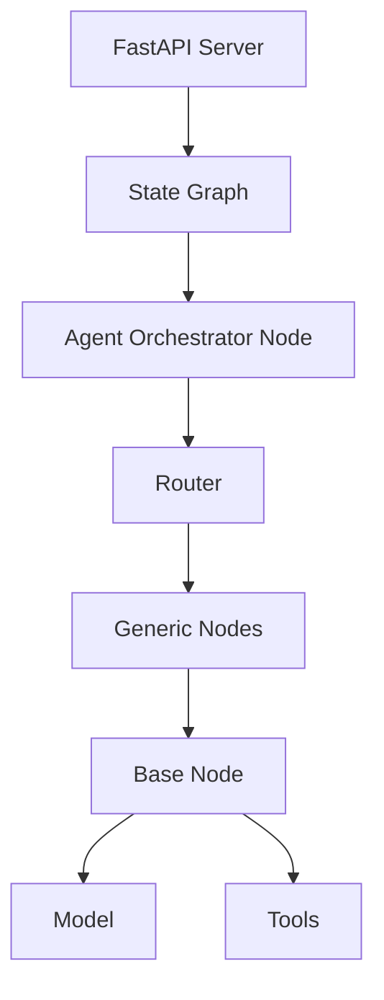

# App Core

Core application of Impressox Agent, built on LLM foundation with modular architecture and high scalability.

## System Architecture



## Key Components

### 1. API Layer (`app/api.py`)
- FastAPI server for request handling
- Support for streaming and non-streaming responses
- Langfuse monitoring integration
- Main endpoints:
  ```python
  POST /threads/{session_id}/runs/stream  # Stream mode
  POST /threads/{session_id}/runs         # Non-stream mode
  ```

### 2. Agent System (`app/agents/`)
- **Agent Orchestrator** (`agent_orchestrator.py`): Process orchestration & management
  - StateGraph management
  - Node routing
  - Checkpoint management

- **Agent Factory** (`agent_factory.py`): Agent management
  - Dynamic agent creation
  - Node-specific configuration
  - Cache management

### 3. Node System (`app/nodes/`)
- **Base Node** (`base.py`): Template for node processing
  ```python
  class BaseNode:
      def __init__(self, model_config_key, tools = None)
      def call_model(self, state: AgentState, config: RunnableConfig)
      def configure_tools(self, tools)
  ```

- **Generic Nodes**: Specialized processing nodes
  - Tool execution
  - Response generation
  - State management

### 4. Tool System (`app/tools/`)
- **Tool Registry** (`app/core/tool_registry.py`): Tool management
  ```python
  @register_tool(node_name="*", name="tool_name")
  def some_tool(args):
      # Tool implementation
  ```
- Node-specific tool categorization
- Easy extension with new tools

### 5. Cache System (`app/cache/`)
- Redis cache for performance
- Checkpoint system for state persistence
- Cache strategies:
  - Memory cache
  - Persistent cache
  - Distributed cache

### 6. Configuration (`app/configs/`)
- Environment-based config
- Service configurations
- Secure credential management

## Processing Flow

1. Client sends request to API endpoint
2. Agent Orchestrator initializes StateGraph
3. Router directs to appropriate node
4. Node processes with relevant tools
5. Results streamed or returned to client

## Development Guide

### Adding New Node

1. Create new node file in `app/nodes/`
2. Inherit from BaseNode
```python
from app.nodes.base import BaseNode

class CustomNode(BaseNode):
    def __init__(self):
        super().__init__("model_config_key")
```

### Adding New Tool

1. Create tool function with decorator
```python
@register_tool(node_name="custom_node", name="custom_tool")
def custom_tool(args):
    # Implementation
    return result
```

### Model Configuration

1. Add config in YAML:
```yaml
model_config_key:
  base_url: ${LLM_BASE_URL}
  api_key: ${LLM_API_KEY}
  model: ${LLM_MODEL}
  temperature: 0
```

## Best Practices

1. **Error Handling**
   - Always handle exceptions
   - Comprehensive logging
   - Fallback mechanisms

2. **Performance**
   - Efficient cache usage
   - Tool execution optimization
   - Response time monitoring

3. **Security**
   - Input validation
   - Secure credentials
   - Rate limiting

4. **Testing**
   - Unit tests for tools
   - Integration tests for nodes
   - End-to-end testing
