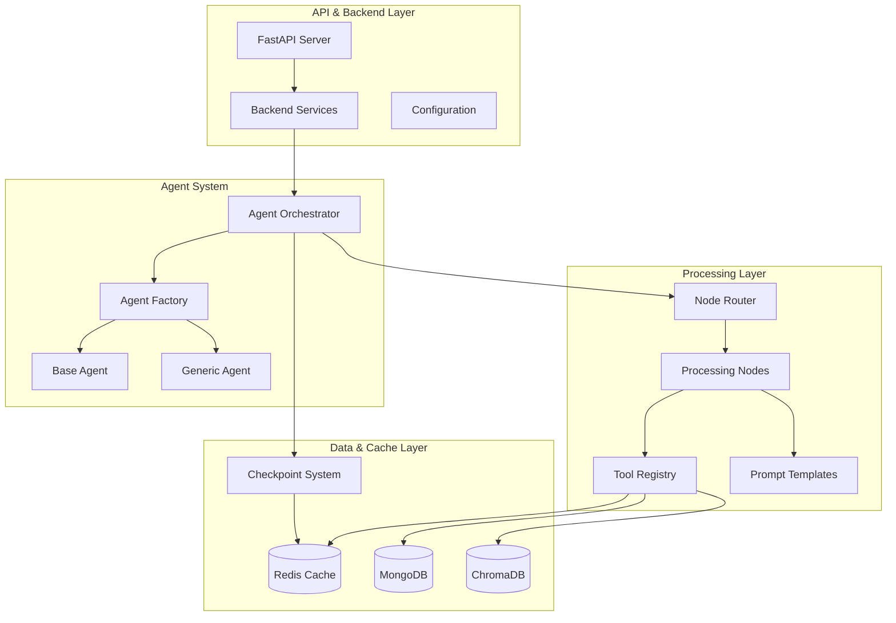

# ImpressoX Core Application Documentation

The `app/` directory contains the core ImpressoX AI Agent implementation, built with a modular architecture focused on extensibility and maintainability.

## System Architecture



## Core Components

### 1. API Layer (`app/api.py`)
-   FastAPI server for handling client requests
-   Support for streaming and non-streaming responses
-   Integration with Backend Services layer
-   Langfuse monitoring integration

### 2. Backend Service Layer (Distributed across `app/`)
-   Handles business logic and data operations
-   Manages external system integrations
-   Coordinates with workers and storage systems

### 3. Agent System (`app/agents/`)
-   **Agent Factory** (`agent_factory.py`): Creates agent instances
-   **Agent Orchestrator** (`agent_orchestrator.py`): Manages agent workflows
-   **Base Agent** (`base_agent.py`): Common agent functionality
-   **Generic Agent** (`generic_agent.py`): Default agent implementation

### 4. Node System (`app/nodes/`)
-   **Base Node** (`base.py`): Abstract node template
-   **General Nodes** (`general_nodes.py`): Multi-purpose processing
-   **Swap Executor** (`swap_executor_node.py`): DeFi swap operations

### 5. Tool System (`app/tools/`)
Current tools in `app/tools/general/`:
```
general/
├── coin_price.py          # Cryptocurrency price queries
├── evm_dex.py            # DEX interactions
├── notification_control.py # Notification management
├── safe_python_tool.py   # Sandboxed Python execution
├── search_knowledge.py   # Knowledge base search
├── summary_social.py     # Social media summarization
├── watch_airdrop.py     # Airdrop monitoring
├── watch_market.py      # Market price monitoring
├── watch_wallet.py      # Wallet monitoring
├── unwatch_airdrop.py   # Remove airdrop monitoring
├── unwatch_market.py    # Remove price monitoring
└── unwatch_wallet.py    # Remove wallet monitoring
```

### 6. Core Services (`app/core/`)
```
core/
├── embedder.py           # Text embedding service
├── mongo_search.py       # MongoDB search utilities
├── system_prompt_manager.py # Prompt template management
├── tool_registry.py      # Tool registration system
└── vector_store.py       # Vector storage interface
```

### 7. Cache System (`app/cache/`)
```
cache/
├── cache_key.py         # Cache key management
├── cache_redis.py       # Redis cache implementation
├── cache_tool.py        # Tool result caching
├── rule_storage.py      # Market rule storage
└── check_point/         # State persistence
    ├── checkpoint_client.py
    ├── mongo_checkpointer.py
    └── redis_checkpointer.py
```

### 8. Prompt Management (`app/prompts/`)
```
prompts/
├── general_prompt.py
├── news_intelligence_prompt.py
├── portfolio_strategy_prompt.py
├── router_prompt.py
├── swap_executor_prompt.py
├── trend_detector_prompt.py
└── wallet_monitor_prompt.py
```

## State and Processing Flow

### Request Processing
1. Client request received by API
2. Backend Services layer handles initial processing
3. Request routed to Agent Orchestrator
4. Agent State initialized/retrieved
5. Node Router selects appropriate processing node
6. Node executes with necessary tools
7. Results cached and returned

### State Management
-   **Agent State**: Tracks conversation context and user preferences
-   **Checkpointing**: Persists state for long-running operations
-   **Caching**: Stores frequently accessed data and tool results

## Tool Development Guide

### Adding a New Tool
1. Create tool file in appropriate category:
```python
from app.core.tool_registry import register_tool
from app.configs.config import NodeName

@register_tool(node_name=NodeName.GENERAL_NODE, tool_name="my_new_tool")
async def my_new_tool(param1: str, param2: int) -> dict:
    """
    Tool description and documentation.
    
    Args:
        param1: Description
        param2: Description
        
    Returns:
        dict: Result format description
    """
    # Implementation
    return {"result": "success"}
```

2. Register tool in `app/tools/__init__.py`
3. Add any necessary configurations
4. Update tool documentation

### Tool Best Practices
-   Include comprehensive docstrings
-   Implement proper error handling
-   Add input validation
-   Consider caching needs
-   Follow async patterns when appropriate

## Configuration Management

### Core Configs (`app/configs/`)
-   **config.py**: Central configuration management
-   Environment variables through `.env`
-   YAML configs in `/configs` directory

### Loading Utilities (`app/utils/config_loader/`)
-   **read_yaml.py**: YAML configuration loader
-   **read_json.py**: JSON configuration loader
-   **config_interface.py**: Configuration interface definition

## Development Guidelines

### Code Organization
-   Keep modules focused and single-purpose
-   Use appropriate abstractions
-   Follow established patterns
-   Document public interfaces

### Testing
-   Unit tests for tools and nodes
-   Integration tests for workflows
-   Mock external dependencies
-   Test async behavior

### Security
-   Validate all inputs
-   Secure credential handling
-   Implement rate limiting
-   Monitor and log operations

### Performance
-   Use caching appropriately
-   Optimize database queries
-   Profile critical paths
-   Monitor memory usage

### Logging
-   Use structured logging
-   Include context information
-   Set appropriate log levels
-   Enable ELK stack integration

## Dependencies & Requirements
See `requirements.txt` for complete list. Key dependencies:
-   FastAPI & uvicorn
-   Redis (caching, rules)
-   MongoDB (persistence)
-   ChromaDB (vector store)
-   Langfuse (LLM monitoring)
