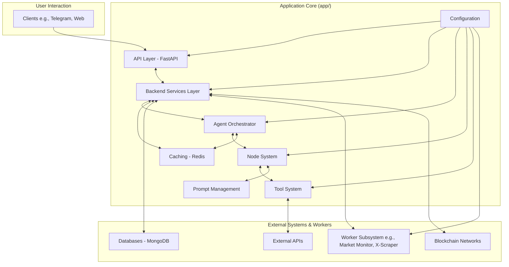

# ImpressoX App Core Documentation

The `app/` directory houses the core application logic for the ImpressoX AI Agent. It's built with a modular architecture, leveraging an LLM foundation for intelligent DeFi wallet management.

## System Architecture Overview

The ImpressoX core application follows a multi-layered architecture designed for scalability and maintainability. Key interactions flow from the API layer through backend services to the agent orchestrator, which then manages node-based processing and tool execution.



## Key Components

### 1. API Layer (`app/api.py`)
-   **Technology**: FastAPI.
-   **Function**: Handles incoming requests from clients, performs initial validation, and routes them to the Backend Service Layer.
-   **Features**: Supports streaming and non-streaming responses, integrates with Langfuse for LLM observability.
-   **Endpoints**:
    -   `POST /threads/{session_id}/runs/stream`: For streaming responses.
    -   `POST /threads/{session_id}/runs`: For non-streaming responses.

### 2. Backend Service Layer (Conceptual, partially in `app/`)
-   **Function**: Acts as an intermediary between the API layer and the core agent logic (Agent Orchestrator, Workers, etc.). It handles business logic, data retrieval/persistence, and integration with external systems (including workers and blockchain).
-   **Design**: Modular, can be deployed as separate services or modules. Aims to decouple the API from complex processing and external dependencies.
-   **Current Implementation**: Aspects of this layer are present within the API handlers and core logic, with ongoing efforts to formalize its separation.

### 3. Agent System (`app/agents/`)
-   **Agent Orchestrator (`agent_orchestrator.py`)**: Manages the overall processing flow of an agent interaction.
    -   Handles state management (potentially using a state graph).
    -   Routes tasks to appropriate nodes.
    -   Manages checkpoints for long-running processes.
-   **Agent Factory (`agent_factory.py`)**: Responsible for creating and configuring agent instances.
    -   Dynamically instantiates agents based on user requests or system events.
    -   Configures nodes and tools for specific agent tasks.
-   **Base Agent (`base_agent.py`)**: Provides a common interface and foundational logic for all agent types.

### 4. Node System (`app/nodes/`)
-   **Base Node (`base.py`)**: An abstract class defining the contract for all processing nodes.
    ```python
    class BaseNode:
        def __init__(self, model_config_key: str, tools: Optional[List[Type[BaseTool]]] = None): ...
        def call_model(self, state: AgentState, config: RunnableConfig) -> AgentState: ...
        # ... other common methods
    ```
-   **Specialized Nodes** (e.g., `general_nodes.py`, `swap_executor_node.py`): Concrete implementations for specific tasks like general queries, swap execution, trend analysis, etc. They utilize specific LLM prompts and tools.

### 5. Tool System (`app/tools/` & `app/core/tool_registry.py`)
-   **Tool Registry (`app/core/tool_registry.py`)**: Manages the registration and discovery of available tools.
    ```python
    @register_tool(node_name="NODE_NAME_ENUM", tool_name="descriptive_tool_name")
    def example_tool_function(argument_one: str, argument_two: int) -> dict:
        # Tool implementation logic
        return {"result": "success"}
    ```
-   **Tool Implementations** (e.g., `app/tools/general/coin_price.py`): Functions that perform specific actions, like fetching data, interacting with external APIs, or executing blockchain transactions. Tools are designed to be modular and reusable.

### 6. Prompt Management (`app/prompts/`)
-   Contains structured prompts for various LLM interactions, categorized by node or agent type (e.g., `general_prompt.py`, `swap_executor_prompt.py`).
-   System prompts are managed by `app/core/system_prompt_manager.py`.

### 7. Cache System (`app/cache/`)
-   **Technology**: Primarily Redis.
-   **Function**: Provides caching for LLM responses, tool results, and session data to improve performance and reduce redundant computations.
-   **Checkpointing** (`app/cache/check_point/`): Persists agent state for long-running or resumable tasks.
-   **Rule Storage** (`app/cache/rule_storage.py`): Stores market monitoring rules in Redis for fast access by the Market Monitor worker.

### 8. Configuration (`app/configs/config.py` & `/configs/`)
-   **Management**: Uses YAML files (in `/configs/`) and environment variables (`.env`).
-   **Loading**: `app/utils/config_loader/` provides utilities to load configurations.
-   **Scope**: Manages settings for LLMs, database connections, API keys, worker parameters, etc.

## Processing Flow Example (User Query)

1.  **Client Request**: A user sends a query (e.g., via Telegram) to an API endpoint.
2.  **API Layer**: FastAPI receives the request, validates it, and forwards it to the Backend Service Layer.
3.  **Backend Service Layer**:
    -   Authenticates the user/session.
    -   May retrieve user-specific context or preferences from a database (e.g., MongoDB).
    -   Determines the appropriate agent or workflow and invokes the Agent Orchestrator.
4.  **Agent Orchestrator**:
    -   Initializes or retrieves the agent's state (e.g., using `AgentState`).
    -   Uses a router (e.g., an LLM-based router or rule-based logic) to select the initial processing node.
5.  **Node Execution**:
    -   The selected node (e.g., `GeneralNode`) is activated.
    -   The node prepares an LLM prompt using templates from `app/prompts/` and the current agent state.
    -   If the task requires external data or actions, the node identifies necessary tools from the `ToolRegistry`.
    -   The LLM is called. It might decide to use one or more tools.
6.  **Tool Execution** (if required):
    -   The Agent Orchestrator (or the node itself) invokes the selected tool(s).
    -   The tool executes its logic (e.g., calls an external API for coin price, queries a database).
    -   Tool results are returned to the node/orchestrator.
7.  **Response Generation**:
    -   The node processes the LLM's output and any tool results to formulate a response.
    -   The agent's state is updated.
8.  **Backend Service Layer**: Receives the processed response from the Agent Orchestrator.
    -   May perform final formatting or logging.
    -   May store results or state changes in the database.
9.  **API Layer**: Streams or returns the final response to the client.
10. **Client**: Displays the response to the user.

## Development Guide

### Adding a New Node

1.  Define your node's purpose and the specific model configuration key it will use (from `configs/llm.yaml`).
2.  Create a new Python file in `app/nodes/` (e.g., `my_custom_node.py`).
3.  Inherit from `BaseNode`:
    ```python
    from app.nodes.base import BaseNode
    from app.core.agent_types import AgentState # Or your specific state type
    from app.configs.config import NodeName # Add your node to Enum if not present

    class MyCustomNode(BaseNode):
        NODE_NAME = NodeName.MY_CUSTOM_NODE # Define a unique name

        def __init__(self, llm_config_key: str = "default_llm_config"): # Or a specific one
            super().__init__(llm_config_key=llm_config_key, node_name=self.NODE_NAME)
            # Initialize any specific tools or configurations here
            # self.configure_tools([...])
    
        async def process(self, state: AgentState, config: RunnableConfig) -> AgentState:
            # Your node's specific logic using self.call_model, tools, etc.
            # Update state with results
            # state['messages'].append(AIMessage(content="Processed by MyCustomNode"))
            return state
    ```
4.  Add your new `NodeName` to the `app.configs.config.NodeName` enum.
5.  Integrate your node into the `AgentOrchestrator`'s graph in `app/agents/agent_orchestrator.py`.

### Adding a New Tool

1.  Identify the node(s) that will use this tool.
2.  Create the tool function in an appropriate file within `app/tools/` (e.g., `app/tools/defi_tools/my_new_tool.py`).
3.  Use the `@register_tool` decorator:
    ```python
    from app.core.tool_registry import register_tool
    from app.configs.config import NodeName # Enum for node names

    @register_tool(node_name=NodeName.GENERAL_NODE, tool_name="get_my_custom_data")
    async def get_my_custom_data(query: str) -> dict:
        """
        Fetches custom data based on the provided query.
        Args:
            query: The search query for the custom data.
        Returns:
            A dictionary containing the custom data or an error message.
        """
        # Tool implementation (can be async or sync)
        # Example: data = await some_api_call(query)
        return {"data": f"Custom data for {query}"}
    ```
4.  Ensure the tool is imported so the decorator runs (e.g., by importing it in `app/tools/__init__.py` or the relevant node file).
5.  (Optional) If the tool requires specific configuration (like API keys), ensure they are handled via the config system.

### Model Configuration

LLM configurations are managed in `configs/llm.yaml`. Example:
```yaml
default_llm_config:
  base_url: ${LLM_BASE_URL}  # Fetched from .env
  api_key: ${LLM_API_KEY}    # Fetched from .env
  model: "claude-3-opus-20240229"
  temperature: 0.1
  # Other parameters like max_tokens, etc.

fast_llm_config:
  # ... configuration for a faster, possibly less capable model
  model: "claude-3-haiku-20240307"
```
Nodes specify which configuration to use when they are initialized.

## Best Practices

1.  **Error Handling**: Implement robust error handling in nodes and tools. Use try-except blocks and return informative error messages or states.
2.  **Logging**: Utilize the application's logging setup (e.g., ELK stack integration) for debugging and monitoring. Add contextual information to logs.
3.  **Asynchronous Operations**: Prefer `async` for I/O-bound operations (API calls, database interactions) to maintain responsiveness.
4.  **Configuration Management**: Avoid hardcoding secrets or configurations. Use the central configuration system.
5.  **Modularity**: Keep nodes and tools focused on specific tasks.
6.  **Testing**: Write unit tests for tools and integration tests for node processing flows.
7.  **Security**:
    -   Validate all inputs, especially those from external sources or user queries.
    -   Be mindful of prompt injection risks if user input directly forms parts of LLM prompts.
    -   Ensure secure handling of API keys and sensitive data.
