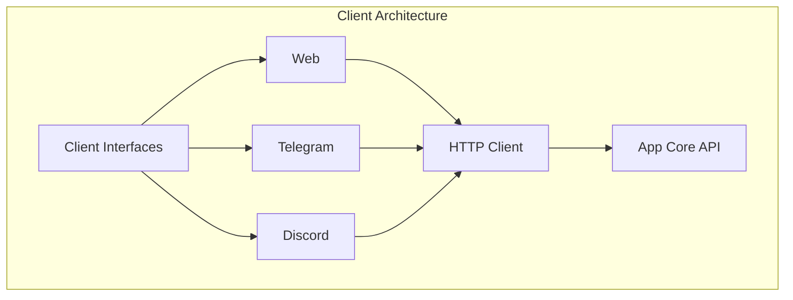

# Clients

Multi-platform interface system for Impressox Agent, enabling user interactions through various channels.

## Client Architecture



## Web Interface

### Structure
```
clients/web/
├── src/
│   ├── components/    # React components
│   ├── hooks/        # Custom hooks
│   ├── services/     # API services
│   ├── contexts/     # React contexts
│   └── utils/        # Utility functions
├── public/
└── package.json
```

### Features
- Real-time chat interface
- Stream response support
- Markdown rendering
- Code highlighting
- File attachments
- Session management

### API Integration
```typescript
// Example chat service
async function sendMessage(sessionId: string, input: any) {
  const response = await fetch(`/api/threads/${sessionId}/runs/stream`, {
    method: 'POST',
    body: JSON.stringify({ input })
  });
  // Handle streaming response
}
```

## Telegram Bot

### Structure
```
clients/telegram/
├── handlers/         # Message handlers
├── commands/        # Bot commands
├── services/        # Business logic
└── utils/          # Helper functions
```

### Features
- Command handling
- Conversation management
- File sharing
- Inline queries
- Keyboard interfaces
- Session persistence

### Bot Configuration
```python
# Example command handler
@bot.command("start")
async def start_command(message: Message):
    session_id = generate_session_id()
    await initialize_session(session_id)
    await bot.reply(message, "Welcome to Impressox!")
```

## Discord Bot

### Structure
```
clients/discord/
├── commands/        # Slash commands
├── events/         # Event handlers
├── services/       # Integration services
└── utils/         # Helper functions
```

### Features
- Slash commands
- Thread management
- Role-based access
- Embeds support
- File handling
- Server management

### Command Registration
```typescript
// Example slash command
new SlashCommandBuilder()
  .setName('chat')
  .setDescription('Start a chat session')
  .addStringOption(option =>
    option.setName('message')
          .setDescription('Your message')
          .setRequired(true)
  )
```

## Common Components

### Session Management
- Unique session IDs for each conversation
- State persistence
- History tracking
- Context management

### Authentication
- OAuth2 integration
- Token management
- Role-based access
- Security policies

### Message Processing
- Input validation
- Rate limiting
- Content filtering
- Error handling

### Development Guide

1. **Initialize Web Client**
```bash
cd clients/web
npm install
npm run dev
```

2. **Setup Telegram Bot**
```bash
cd clients/telegram
python -m venv venv
source venv/bin/activate
pip install -r requirements.txt
python bot.py
```

3. **Setup Discord Bot**
```bash
cd clients/discord
npm install
npm run dev
```

## Best Practices

### 1. Error Handling
- Graceful degradation
- User-friendly error messages
- Logging and monitoring
- Retry mechanisms

### 2. Performance
- Request caching
- Lazy loading
- Resource optimization
- Connection pooling

### 3. Security
- Input sanitization
- Rate limiting
- Authentication
- Data encryption

### 4. UX/UI
- Responsive design
- Loading states
- Error feedback
- Clear navigation

## Testing

### Unit Tests
```bash
# Web
npm run test

# Telegram/Discord
python -m pytest
```

### Integration Tests
- API endpoint testing
- Bot command testing
- Authentication flow
- Error scenarios

### End-to-end Testing
- User journey testing
- Cross-platform scenarios
- Performance testing
- Load testing

## Deployment

### Web Client
- Build optimization
- CDN configuration
- Environmental variables
- CI/CD pipeline

### Bot Deployment
- Server setup
- Environment configuration
- Monitoring setup
- Backup strategy
