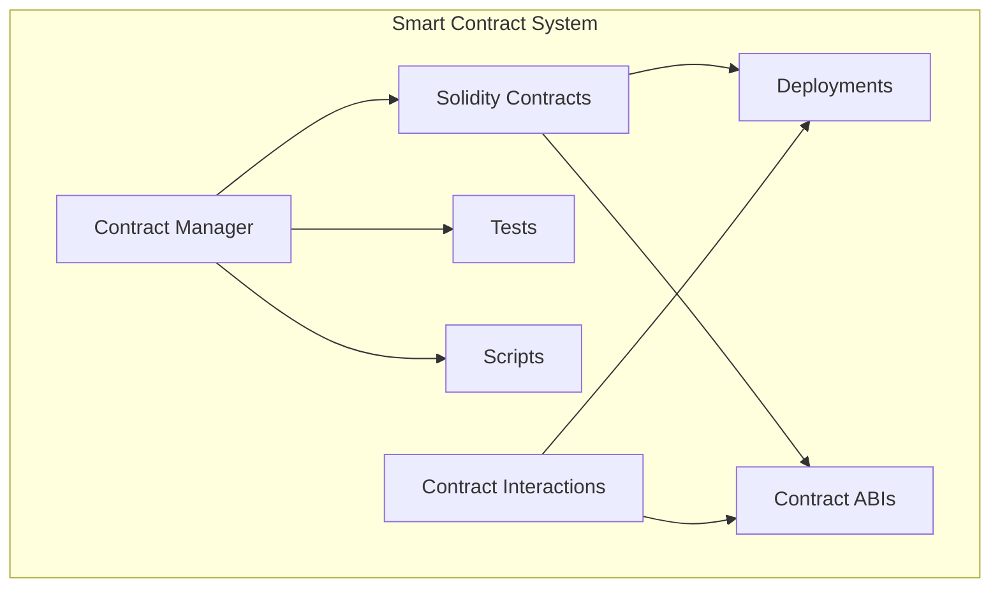

# Smart Contracts

Smart contract system of Impressox Agent, enabling blockchain interactions and automated transactions.

## Smart Contract Architecture



## Directory Structure

```
contracts/
├── solidity/           # Smart contract source code 
│   ├── core/          # Core contracts
│   ├── interfaces/    # Contract interfaces
│   └── libraries/     # Reusable libraries
│
├── tests/             # Test suite
│   ├── unit/         # Unit tests
│   └── integration/  # Integration tests
│
├── scripts/           # Deployment & management scripts
│   ├── deploy/       # Deployment scripts
│   └── tasks/        # Hardhat tasks
│
└── deployments/       # Deployment artifacts
    ├── mainnet/      # Mainnet deployments
    └── testnet/      # Testnet deployments
```

## Core Contracts

### Contract Development
```solidity
// Example smart contract
// SPDX-License-Identifier: MIT
pragma solidity ^0.8.0;

contract ImpressoxManager {
    // State variables
    address public owner;
    mapping(address => bool) public operators;

    // Events
    event OperatorAdded(address operator);
    event OperatorRemoved(address operator);

    constructor() {
        owner = msg.sender;
    }

    // Modifiers
    modifier onlyOwner() {
        require(msg.sender == owner, "Only owner");
        _;
    }

    // Functions
    function addOperator(address _operator) public onlyOwner {
        operators[_operator] = true;
        emit OperatorAdded(_operator);
    }
}
```

### Testing
```typescript
import { expect } from "chai";
import { ethers } from "hardhat";

describe("ImpressoxManager", function () {
  it("Should set the right owner", async function () {
    const ImpressoxManager = await ethers.getContractFactory("ImpressoxManager");
    const manager = await ImpressoxManager.deploy();
    await manager.deployed();

    expect(await manager.owner()).to.equal(await ethers.provider.getSigner(0).getAddress());
  });
});
```

## Development Guide

### Environment Setup

1. Install dependencies:
```bash
cd contracts
npm install
```

2. Configure networks:
```javascript
// hardhat.config.js
module.exports = {
  networks: {
    hardhat: {
      // Local development
    },
    testnet: {
      url: process.env.TESTNET_RPC,
      accounts: [process.env.PRIVATE_KEY]
    },
    mainnet: {
      url: process.env.MAINNET_RPC,
      accounts: [process.env.PRIVATE_KEY]
    }
  }
};
```

### Deployment

1. Deploy contracts:
```bash
# Deploy to testnet
npx hardhat run scripts/deploy.js --network testnet

# Deploy to mainnet
npx hardhat run scripts/deploy.js --network mainnet
```

2. Verify contracts:
```bash
npx hardhat verify --network mainnet DEPLOYED_CONTRACT_ADDRESS
```

### Contract Interactions

#### Web3 Integration
```typescript
// Example contract interaction
import { ethers } from 'ethers';
import { ImpressoxManager } from './contracts';

async function interactWithContract() {
  const provider = new ethers.providers.JsonRpcProvider(RPC_URL);
  const signer = new ethers.Wallet(PRIVATE_KEY, provider);
  
  const contract = new ethers.Contract(
    CONTRACT_ADDRESS,
    ImpressoxManager.abi,
    signer
  );

  // Call contract methods
  const tx = await contract.addOperator(OPERATOR_ADDRESS);
  await tx.wait();
}
```

## Security

### Best Practices

1. **Code Security**
   - Input validation
   - Access control
   - Re-entrancy protection
   - Gas optimization

2. **Testing**
   - Unit tests
   - Integration tests
   - Fuzzing tests
   - Mainnet forking

3. **Auditing**
   - Static analysis
   - Dynamic analysis
   - Manual review
   - Third-party audits

### Security Checklist

```markdown
- [ ] Access control implemented
- [ ] Input validation
- [ ] Re-entrancy guards
- [ ] Event emission
- [ ] Gas optimization
- [ ] Error handling
- [ ] Upgrade mechanism
- [ ] Emergency stops
```

## Monitoring & Maintenance

### Contract Monitoring
- Transaction tracking
- Event listening
- Gas usage monitoring
- Error detection

### Maintenance Tasks
```typescript
// Example maintenance task
task("check-operators", "Checks all operators")
  .setAction(async (args, hre) => {
    const contract = await getContract();
    // Perform checks
    const activeOperators = await contract.getActiveOperators();
    console.log("Active operators:", activeOperators);
  });
```

## Gas Optimization

### Strategies
- Batch operations
- Data packing
- Memory vs Storage
- Loop optimization

### Example Optimization
```solidity
// Gas optimized mapping access
contract OptimizedContract {
    struct UserData {
        uint256 balance;
        uint256 timestamp;
        bool isActive;
    }
    
    mapping(address => UserData) public userData;
    
    function updateUser(uint256 _balance) external {
        UserData storage user = userData[msg.sender];
        user.balance = _balance;
        user.timestamp = block.timestamp;
        user.isActive = true;
    }
}
```

## Upgrade Strategy

### Proxy Pattern
```solidity
contract Proxy {
    address public implementation;
    address public admin;
    
    function upgrade(address newImplementation) external {
        require(msg.sender == admin, "Only admin");
        implementation = newImplementation;
    }
}
```

### Version Management
- Contract versioning
- State migration
- Backward compatibility
- Upgrade coordination

## Documentation

### Contract Documentation
```solidity
/// @title ImpressoxManager
/// @notice Manages operator access and core functionality
/// @dev Implements access control and operator management
contract ImpressoxManager {
    /// @notice Add a new operator
    /// @param _operator Address of the new operator
    /// @dev Only callable by contract owner
    function addOperator(address _operator) public onlyOwner {
        // Implementation
    }
}
```

### API Documentation
- Function signatures
- Event definitions
- Error codes
- Integration guides
