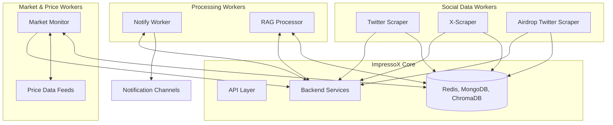

# ImpressoX Workers Documentation

The `workers/` directory contains background worker processes that handle automated tasks, data processing, and monitoring for the ImpressoX AI Agent.

## Worker Architecture Overview



## Implemented Workers

### 1. Market Monitor (`workers/market_monitor/`)
-   **Purpose**: Monitors cryptocurrency prices and executes rule-based alerts
-   **Key Components**:
    ```
    market_monitor/
    ├── monitor.py           # Main worker script
    ├── processors/
    │   ├── notify_dispatcher.py  # Handles alert dispatch
    │   └── rule_matcher.py      # Matches price rules
    └── shared/              # Shared utilities and models
    ```
-   **Features**:
    -   Real-time price monitoring
    -   Rule-based alert system
    -   Integration with Redis for rule storage
    -   Notification dispatch

### 2. X-Scraper (`workers/x-scraper/`)
-   **Purpose**: Scrapes data from X/Twitter using browser automation
-   **Technology**: Node.js, Puppeteer
-   **Structure**:
    ```
    x-scraper/
    ├── index.js            # Main scraper script
    ├── utils/
    │   ├── login.js        # X authentication
    │   ├── proxyManager.js # Proxy rotation
    │   └── mongo.js        # Data storage
    └── accounts/           # X account credentials
    ```

### 3. Twitter Scraper (`workers/twitter_scraper/`)
-   **Purpose**: Alternative Twitter data collection implementation
-   **Components**:
    -   `scraper.py`: Main scraping logic
    -   Integration with MongoDB for storage
    -   Configurable scraping parameters

### 4. Airdrop Twitter Scraper (`workers/airdrop_twitter_scraper/`)
-   **Purpose**: Specialized scraper for airdrop-related content
-   **Features**:
    -   Keyword-based filtering (`config/keywords.txt`)
    -   Targeted account monitoring
    -   Airdrop opportunity detection

### 5. Notify Worker (`workers/notify_worker/`)
-   **Purpose**: Centralized notification management
-   **Components**:
    ```
    notify_worker/
    ├── main.py             # Worker entry point
    ├── redis_listener.py   # Event subscription
    ├── data_fetcher.py     # Data retrieval
    ├── telegram_notifier.py # Telegram notifications
    └── scheduler.py        # Scheduled notifications
    ```
-   **Features**:
    -   Multiple notification channels
    -   Message queuing and retry logic
    -   User preference management

### 6. RAG Processor (`workers/rag_processor/`)
-   **Purpose**: Handles Retrieval Augmented Generation tasks
-   **Components**:
    ```
    rag_processor/
    ├── scheduler.py        # Job scheduling
    ├── common/             # Shared utilities
    ├── jobs/              # Processing jobs
    └── rag_configs/       # Configuration files
    ```
-   **Features**:
    -   Document processing and embedding
    -   Vector store management
    -   Knowledge retrieval for LLM context

## Worker Management

### Configuration
Each worker typically has:
-   `.env` file for environment variables
-   `Dockerfile` and `build.sh` for containerization
-   `requirements.txt` or `package.json` for dependencies

### Deployment
-   **Local Development**:
    ```bash
    # Example for Market Monitor
    cd workers/market_monitor
    python -m venv venv
    source venv/bin/activate
    pip install -r requirements.txt
    python monitor.py

    # Example for X-Scraper
    cd workers/x-scraper
    npm install
    node index.js
    ```

-   **Docker Deployment**:
    ```bash
    # Using build scripts
    ./workers/market_monitor/build.sh
    ./workers/x-scraper/build.sh
    ```

### Monitoring & Logging
-   ELK Stack integration for log aggregation
-   Health check endpoints
-   Performance metrics collection

## Data Flow & Integration

### State Management
-   Redis for temporary data and rules
-   MongoDB for persistent storage
-   ChromaDB for vector embeddings

### Inter-Worker Communication
-   Redis Pub/Sub for events
-   MongoDB for shared data access
-   Direct API calls when necessary

### Error Handling
-   Retry mechanisms for failed operations
-   Dead letter queues for failed messages
-   Error logging and monitoring

## Development Guidelines

### Adding New Workers
1.  Create worker directory with standard structure:
    ```
    workers/new_worker/
    ├── main.py or index.js
    ├── Dockerfile
    ├── build.sh
    ├── requirements.txt or package.json
    └── README.md
    ```

2.  Implement core functionality following existing patterns
3.  Add configuration management
4.  Include logging and monitoring
5.  Add containerization support
6.  Update documentation

### Best Practices
-   Use environment variables for configuration
-   Implement graceful shutdown
-   Add comprehensive logging
-   Include health checks
-   Write worker-specific documentation
-   Follow existing code patterns
