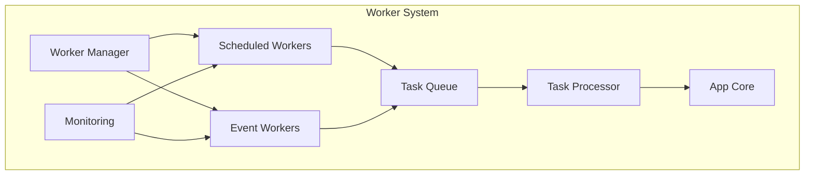

# Workers

Automated worker system of Impressox Agent, handling background tasks and event processing.

## Worker Architecture



## Scheduled Workers

### Structure
```
workers/scheduled/
├── tasks/          # Task definitions
├── schedulers/     # Task schedulers
├── processors/     # Task processors
└── utils/         # Utility functions
```

### Features
- Cron-based scheduling
- Task prioritization
- Retry mechanisms
- Error handling
- Task monitoring

### Task Configuration
```python
# Example scheduled task
@scheduled_task(cron="0 0 * * *")  # Run daily at midnight
async def daily_cleanup():
    # Clean up old sessions
    await cleanup_expired_sessions()
    # Archive old conversations
    await archive_old_conversations()
```

## Event Workers

### Structure
```
workers/events/
├── handlers/       # Event handlers
├── processors/     # Event processors
├── queues/        # Event queues
└── utils/         # Helper functions
```

### Features
- Event subscription
- Real-time processing
- Queue management
- Error recovery
- Event logging

### Event Handler
```python
# Example event handler
@event_handler("user.signup")
async def handle_signup(event_data):
    # Process user signup
    user_id = event_data["user_id"]
    # Initialize user resources
    await initialize_user_workspace(user_id)
```

## Worker Management

### Task Queue
- Priority-based queuing
- Task scheduling
- Queue monitoring
- Rate limiting

### Job Processing
- Parallel execution
- Resource management
- Error handling
- Status tracking

### Configuration
```yaml
# Example worker config
worker_config:
  max_concurrent_tasks: 10
  retry_limit: 3
  timeout: 300
  queue_size: 1000
```

## Development Guide

### Adding New Scheduled Task

1. Create task definition:
```python
from workers.scheduled import scheduled_task

@scheduled_task(
    name="custom_task",
    cron="*/15 * * * *",  # Run every 15 minutes
    retry_limit=3
)
async def custom_task():
    # Task implementation
    pass
```

2. Configure task properties:
```python
task_config = {
    "timeout": 60,
    "priority": 1,
    "retry_delay": 300
}
```

### Adding New Event Handler

1. Create event handler:
```python
from workers.events import event_handler

@event_handler("custom.event")
async def handle_custom_event(event_data):
    # Handler implementation
    pass
```

2. Register event subscription:
```python
event_config = {
    "queue": "high_priority",
    "max_retries": 3,
    "timeout": 30
}
```

## Monitoring & Logging

### Metrics Collection
- Task completion rates
- Processing times
- Error rates
- Queue lengths

### Logging System
```python
# Example logging configuration
import logging

logging.config.dictConfig({
    'version': 1,
    'handlers': {
        'console': {
            'class': 'logging.StreamHandler',
            'level': 'INFO'
        },
        'file': {
            'class': 'logging.FileHandler',
            'filename': 'worker.log',
            'level': 'DEBUG'
        }
    }
})
```

## Error Handling

### Retry Strategy
- Exponential backoff
- Max retry limits
- Error categorization
- Fallback mechanisms

### Error Recovery
```python
# Example retry decorator
def with_retry(max_retries=3, backoff_factor=2):
    def decorator(func):
        async def wrapper(*args, **kwargs):
            retry_count = 0
            while retry_count < max_retries:
                try:
                    return await func(*args, **kwargs)
                except Exception as e:
                    retry_count += 1
                    if retry_count == max_retries:
                        raise
                    await asyncio.sleep(backoff_factor ** retry_count)
        return wrapper
    return decorator
```

## Deployment

### Setup
```bash
cd workers
python -m venv venv
source venv/bin/activate
pip install -r requirements.txt
```

### Configuration
```bash
# Set environment variables
export WORKER_QUEUE_TYPE=redis
export WORKER_CONCURRENCY=5
export WORKER_LOG_LEVEL=INFO
```

### Running Workers
```bash
# Start scheduled workers
python -m workers.scheduled

# Start event workers
python -m workers.events
```

## Best Practices

1. **Task Design**
   - Idempotent operations
   - Atomic transactions
   - Clear failure states
   - Progress tracking

2. **Resource Management**
   - Connection pooling
   - Memory monitoring
   - CPU utilization
   - Disk usage control

3. **Monitoring**
   - Health checks
   - Performance metrics
   - Error tracking
   - Queue monitoring

4. **Maintenance**
   - Regular cleanup
   - Log rotation
   - Queue pruning
   - Performance tuning
