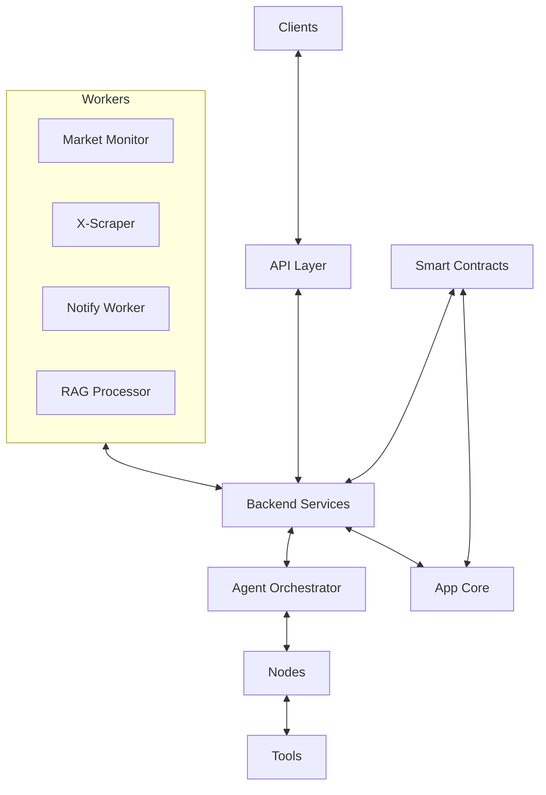

# System Patterns: Impressox Agent

## System Architecture Overview

- **Modular, multi-layered architecture**: Core app, backends, clients, workers, smart contracts.
- **Backend service layer**: Backend services handle business logic, data retrieval, and external system integration, separate from the API layer. They can be deployed as modules or microservices, communicating with the API, workers, smart contracts, and storage systems.
- **LLM-centric orchestration**: Agent orchestrator manages state, routing, and tool execution.
- **Node-based processing**: Specialized nodes inherit from a common base, enabling extensibility.
- **Tool registry pattern**: Tools are registered and invoked dynamically per node/task.
- **Caching and checkpointing**: Redis and persistent storage for state, performance, and recovery.
- **Multi-platform client abstraction**: Web, Telegram, Discord clients share unified API and session logic.
- **Worker subsystem**: 
  - Market monitor worker for price tracking and rule-based notifications
  - X-scraper worker for social media data collection
  - Notify worker for alert distribution
  - RAG processor for knowledge embedding
  - Scheduled and event-driven workers for automation
- **Smart contract integration**: Solidity contracts, deployment scripts, and blockchain interaction layer.

## Key Technical Decisions

- **FastAPI** for API layer and async processing.
- **Redis** for caching, checkpointing and rule storage.
- **MongoDB** for persistent data storage.
- **YAML/ENV** for configuration management.
- **React** for web client, Python for bots, Solidity for contracts.
- **Decorator-based registration** for tools, tasks, and event handlers.
- **Task queue and event queue** for background processing.
- **Proxy pattern** for upgradable smart contracts.

## Design Patterns

- **Factory pattern**: AgentFactory for dynamic agent instantiation.
- **Orchestrator pattern**: AgentOrchestrator for managing agent workflows.
- **Template method**: BaseNode defines processing contract for all nodes.
- **Registry pattern**: Tool registry, event/task handler registries.
- **Observer pattern**: Event-driven workers and contract event listeners.
- **Strategy pattern**: Pluggable cache and checkpoint strategies.
- **Rule Engine pattern**: Market monitor uses rules for price tracking and alerts.

## Component Relationships

## Critical Implementation Paths

- Request → API → Backend Service → Orchestrator → Node(s) → Tool(s) → Response/Stream
- Client → API → Backend Service → Session/State Management
- Worker → Task/Event Queue → Backend Service → Processor → App Core
- App Core → Backend Service → Blockchain → Smart Contract → Event/Transaction
- Market Alert → Rule Engine → Notify Worker → Client Notification

## Extensibility

- Add new backend services/modules to extend business logic or integrate external systems.
- Add new nodes/tools via inheritance and registration.
- Add new clients by implementing API integration.
- Add new workers by registering tasks/events.
- Add/upgrade contracts using proxy and deployment scripts.
- Add new market monitoring rules without code changes.
